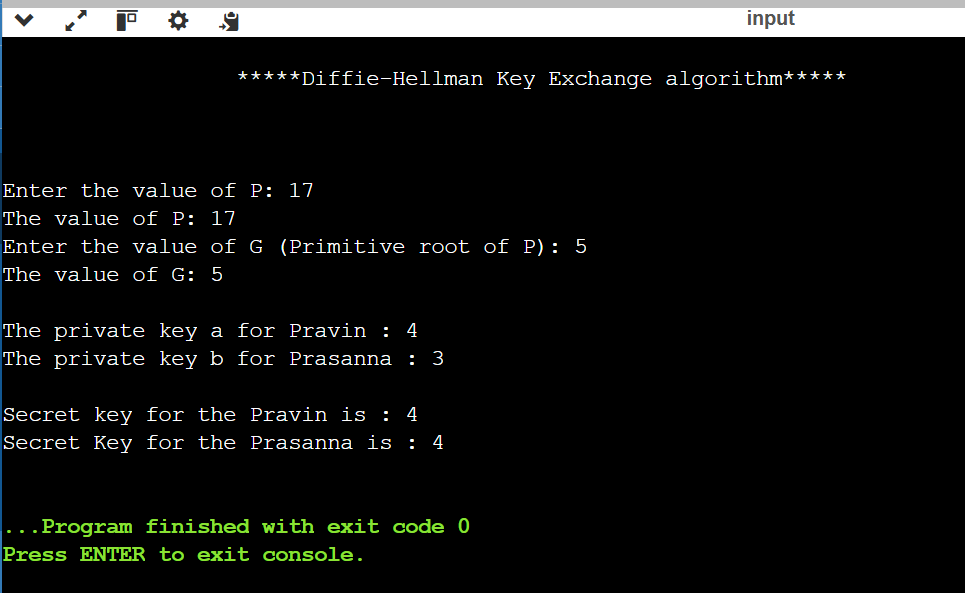

# EX.10 SIMULATION OF DIFFIE HELLMAN ALGORITHM
# AIM:
To implement key exchange between users using Diffie Hellman algorithm.

# ALGORITHM:
1. Get the input for prime number p.
2. Calculate the primitive root of p that is g.
3. Calculate private keys for both users using p and g values.
4. Similarly, secret keys for both users are calculated.

# PROGRAM :
~~~
#include <math.h>
#include <stdio.h>
// Power function to return value of a ^ b mod P
long long int power(long long int a, long long int b,
long long int P)
{
    if (b == 1)
    return a;
    else
    return (((long long int)pow(a, b)) % P);
}
// Driver program
int main()
{
    long long int P, G, x, a, y, b, ka, kb;
    // Both the persons will be agreed upon the
    // public keys G and P
    printf("\n                  *****Diffie-Hellman Key Exchange algorithm*****\n\n");
    printf("\n\nEnter the value of P: ");
    scanf("%lld",&P); // A prime number P is taken
    printf("The value of P: %lld\n", P);
    printf("Enter the value of G (Primitive root of P): ");
    scanf("%lld",&G); // A primitive root for P, G is taken
    printf("The value of G: %lld\n\n", G);
    // Alice will choose the private key a
    a = 4; // a is the chosen private key
    printf("The private key a for Pravin : %lld\n", a);
    x = power(G, a, P); // gets the generated key
    // Bob will choose the private key b
    b = 3; // b is the chosen private key
    printf("The private key b for Prasanna : %lld\n\n", b);
    y = power(G, b, P); // gets the generated key
    // Generating the secret key after the exchange
    // of keys
    ka = power(y, a, P); // Secret key for Alice
    kb = power(x, b, P); // Secret key for Bob
    printf("Secret key for the Pravin is : %lld\n", ka);
    printf("Secret Key for the Prasanna is : %lld\n", kb);
    return 0;
}

~~~

# OUTPUT:

# RESULT:
Hence, the simulation of Diffie Hellman algorithm is successfully done.

